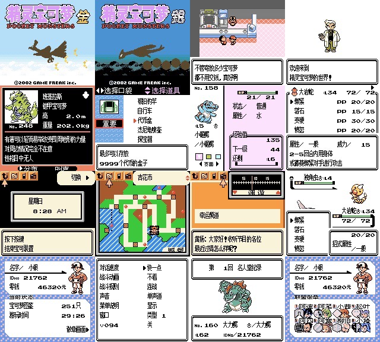

# 宝可梦·金/银 中文v1.1汉化版 by Tom_C

**如果游戏中有任何问题，比如死机，缺字，翻译错误等问题可以在 Github Issue 板块反馈，或者发送邮件到 gs_report@outlook.com，反馈问题时最好能带上游戏的截图**

**在开始之前：如果你是玩家的话，下面的链接包含了输入中文的转换工具，以及部分用于时钟重置的工具**

[https://tomjinw.github.io/convert/](https://tomjinw.github.io/convert/)

## 总结

**「宝可梦金·银」** 作为本人的入门宝可梦系列，它真的给我带了很多愉快的回忆。我至今都记得还是小朋友我每天一写完作业就会打开GBA SP，踏上这个奇幻的冒险之旅。但受制于当时汉化版的翻译质量，有很多东西的确是没能体会到。现在想想，可能除了「肥大出饰拳」之外，别的什么都想不起来了。

在 **「精灵宝可梦太阳·月亮」** 公布的那天，在宣传片中出现了韩版 **「宝可梦金·银」** 的身影，我当时是第一次知道了这个神奇版本的存在。然后因为我自身的条件，我就在想，是不是可以尝试去汉化这个版本呢? 嘛，其实这个计划早在几年前就想试试看了，但是碍于当时时间限制，以及一直未能找到导出文本的方法就只好作罢。不过今年我总算是搞定了很多东西。所以这个汉化版才能够得以实现。

## 如何使用补丁
- 在 Github 上面的 Release 板块下面下载补丁并解压。
- 前往 [https://www.marcrobledo.com/RomPatcher.js/](https://www.marcrobledo.com/RomPatcher.js/) 在网页上打补丁。
- 或者使用第三方工具比如 MultiPatch 等对原版 ROM 使用 ips 补丁。原版ROM现在网上Google上很好找的，我就不提示过多了。补丁的话有适用于韩版的和美版的补丁。

## 关于汉化版 v1.1
- 这个版本相对于1.0版，修复了一些关键的流程Bug，建议所有玩家都更新到最新版。旧版汉化版/韩版的存档可以无缝继承到新版本中。
- 如何区别旧版本：在游戏的设置页面的左下方会有多出来的v110字样就是新版。

## 2022.03.15 v1.1 相比v1.0更新内容
### 死机和流程问题修复
- 修正「宝可梦·金」里，包括满金市美容兄弟在內的部分剧情可能无法触发的问题。**这个 Bug 属于 ROM 数据错误的问题，性质较严重，建议现有玩家马上更新。**
- 修正当捕捉新宝可梦，即将录入宝可梦图鉴时，录入图鉴音效未能正确播放的问题。

### 显示修复（鸣谢：monkey7581sss888）
- 修正图鉴中部分使用小字的宝可梦说明
- 替换了全图鉴奖状中的韩语图片

### 翻译修复
- 修正部分道具/招式说明的相关术语
- 修正部分错别字
- 修正一些不合适的文本控制符号
- 修正一些话术

## 2021.06.23 v1.0 准汉化版相比v0.93版更改内容

### 死机和流程问题修复
- 修复NPC使用「十万伏特」之后死机的问题
- 修复使用神奇糖果死机问题
- 修复火箭队广播死机问题
- 修复送件任务无法完成的问题

### 显示问题修复
- 修复地面属性显示为「次」的问题
- 修复银版中狂热迷的壶壶昵称和初训家名称问题（鬼知道为什么这段文本两个版本存储的地方不一样啊）
- 修复垂钓之家公告牌默认训练家名称未翻译的问题，如果是从v0.93版或者韩版继承存档，默认训练家名字将会维持乱码，直到主角破纪录为止。
- 修复了玉虹游戏城赠送的代币未翻译的问题
- 修复了在招式列表里按A移动招式时「어디로 이동하겠습니까?」（要移动到哪里？）未翻译并乱码的问题。
- 修复了未在游戏中出现的训练家未翻译的问题，这些训练家的名称有时会出现在「那座城 这些人」的广播节目中。
- 修复了「宝可梦图鉴讲堂」广播节目中，会读取到ROM中遗留韩语并乱码的问题。
- 修正了一些不合适或者显示错误的文本的控制符号

### 翻译相关
- 按照最新官方译名修改术语，比如宝可齿轮->宝可装置以及一些菜单术语等
- 修正了「互连洞穴」被错翻为「通海洞穴」的奇妙问题。（我当时在想什么）
- 标准语句如战斗系统等绝大多数改为使用官方术语，也修复了一些翻译错误
- 翻新了广播节目中的话术
- 修正了错误的翻译比如烟墨市道馆最后要拿的是「龙之牙」而非「龙之鳞片」
- 更改了仅在第二世代出现的树果的译名
- 只要长度允许，在文本中添加了一些逗号用于断句

### 新增功能
- 图鉴顺序由韩文顺序改为拼音顺序模式
- 将「正在写入记录，请勿切断电源」文本的出现节奏调整成和原韩版近似。如果各位有人想玩复制Bug，断电的时机是普通速度的文本下面，出现「请勿切断电源」之后，「『主角名』完好地写下了记录」之前。

### 小字与长度修正
- 根据 Github 用户 monkey7581sss888 的补丁，成功让宝可装置显示完整星期。使用这个思路解决了游戏中绝大数数使用小字的地方。

### 其他
- 放大了标题图片
- 码表替换：下面的字符如果继承v0.93版存档，用在宝可梦或者主角名称中会导致字符被新字替换：
	- 「舟」<-> 「瑕」 
	- 「企」<-> 「绚」 
	- 「众」<-> 「栋」 
	- 「伞」<-> 「枚」 
	- 「肋」<-> 「煌」
	- 「旬」<-> 「署」
	- 「旭」<-> 「肥」
	
	
## 已经汉化的内容

- 几乎所有的文本。这包括所有的系统文本，战斗文本，剧情文本，图鉴文本，数据库文本。简单的说文字基本上是完全汉化的。
- 未经压缩的图片：包括背包系统图片，训练家卡片，起名界面，GBC专属提示界面等等。
- 绝大多数压缩的图片。这包括：标题画面、地图图片的城都和关都字样、图鉴系统下方操作提示、遗迹拼图的操作提示、广播系统的调频字样。

## 关于中文输入和时钟重置
- 很遗憾我的水平还不足以重新写一个新的中文输入法，但是韩文也是一种拼读文字，所以为了方便大家输入中文，我准备了一个网页可以把中文汉字转换成对应码表的拼写。链接在这个文档的最上方。为了方便大家识别，我把名称输入的Hangul的符号换成了英文。请注意这些英文并非和其他国际版互相兼容，仅仅是为了方便大家识别输入码所以才修改的。这些英文本质上还是韩语，所以无法用它拼写出所有的英文单词。
- 比如输入「肥大」：就在输入法中输入「O c B」「A e S」就可以了。

## 新增相比原版的改动内容
- 修订HP大于48时，HP减少时状态栏动画速度变慢的问题。
- 修复原版 ROM 中「速度球」「甜蜜球」「月亮球」对捕获率修正错误的问题。具体来说：
	- 修复月亮球只影响使用「灼伤药」进化的宝可梦的捕获率的错误。
	- 修复甜蜜球同性时才影响捕获率的错误。
	- 修复速度球只影响小磁怪、蔓藤怪或臭泥的错误。
- 修复原版 ROM 中，野生宝可梦处于「麻痹」「灼伤」「中毒」时捕获修正不增加的问题。
- 修复原版 ROM 中，当名人堂登录次数超过200次时名人堂记录文本未更新的问题。

## 确定并非汉化版的Bug
- 烧焦塔碎岩无法出现野生宝可梦，已确定原版韩版和某些欧洲地区版本一样。这个地方不会出现碎岩宝可梦。
- 将宝可梦归还给狂热迷时，如果在归还后主角会处于无法战斗的状态，狂热迷会错误地使用归还之后的文本「对宝可梦来说 和认真培养它们的人一起渡过时光 这就是它们的幸福吧」。这个是所有地区的原版ROM都存在的问题。如果有哪位大神愿意修改程序，对应的文本「00175036,52,我要是收下宝可梦的话{5A}你就无法参加战斗了!{5E}」也已经翻译在 ROM 中。

## 现在未能，将来很长时间应该也不会完善的内容
- 真正意义的中文输入法
- 神秘礼物标题界面图片有缺损
- 因字节限制做的改动：
	- 「真理香」改成小字，这个是韩版原ROM的失误，真理香在战斗中三个字的名字被错翻成了两个字。
	- 部分剧情文本
- 部分位置，比如宝可梦种类，训练家名字，因为填充字节的原因所以可能会有多余的空格。
	

## 兼容性与联动状况

### 兼容性：

- 黑白机兼容性： 
 
	| 初代 Game Boy | Game Boy Pocket | Game Boy Light | 初代 Super Game Boy|
	|:-----:|:----:|:----:|:----:|
	| ❌不兼容 | ❌不兼容 | ❌不兼容 | ❌不兼容 |
	- 因为原韩版使用额外 VRAM 显示韩文，以及使用 GBC 8Mhz CPU 主频驱动文本显示，**本汉化版无法支持黑白 Game Boy 机型。敬请见谅，目前不论是工作量还是技术难度都不允许我另行制作黑白机版本。**
	
- 彩机兼容性：
		
	|Game Boy Color|Game Boy Advance (SP)|Super Game Boy 2|Game Boy Player|Game Boy Micro|
	|:-----:|:----:|:----:|:----:|:----:|
	| ✅兼容 | ✅兼容 | ✅兼容 | ✅兼容 | ❌不兼容 |

	- 原韩版「宝可梦 金·银」是 Game Boy Color 专属游戏。本汉化版仅能在上述环境下游玩。
	- Game Boy Micro 不兼容 Game Boy 和 Game Boy Color 游戏。

 

### 存档迁移兼容性，用于需要从其他版本转移存档：

| 从本汉化版/韩版迁移 | 从日版游戏迁移 | 从国际版游戏迁移 | 
|:-----:|:----:|:----:|
| ✅可以迁移 | ❌无法迁移 | ❌无法迁移 |
	
- 仅能迁移韩版和（旧版）本汉化版的存档。其他地区的游戏存档和韩版/本汉化版无法兼容。

 

### 游戏内联机相关： 

- 如果要在 Nintendo 3DS Virtual Console 实现无线联机，不光要遵从以下限制，还有和 Virtual Console 相关的条件需要满足才能实现无线联机。

-  本汉化版编码中已经规避掉对其他国际版游戏中会出现严重错误的编码，但是在输入法仍然可以输入这些字符，不受对方版本支持的字符在本汉化版中会以「?」显示。取名时请务必不要使用对应韩版的这些字符：

		-  덥 로 벗 셰 엎 죔 층 팡 힝 갠 꿨 도 룟 볕 쇔 영 쥔 캔 펙
		
- 与第二世代联机时：
	
	|功能| 和本汉化版/韩版| 和国际版 | 和CKN汉化版「水晶」 |和日版/D商汉化版 | 
	|:-----:|:----:|:----:|:----:|:----:|
	| 交换宝可梦 | ✅可以联机 | ✅可以联机1 |✅可以联机1 |❌无法联机|
	| 对战 | ✅可以联机 | ✅可以联机1 |✅可以联机1 |❌无法联机 |
	| 神秘礼物 | ✅可以联机 | ❌无法联机 | ❌无法联机 |❌无法联机 |
	
	- 1：联机时，本汉化版的宝可梦身上不能携带邮件。请先取下邮件。
	- 1：双方联机时，宝可梦/训练家名字显示会存在异常但不影响基本功能。中文名称可能会乱码，英文名称可能会显示不全。尽可能使用英文字符可以保证最大的兼容性。
	- **无法和日版联机，强行和日版联机可能会有损坏存档的风险，请勿尝试。**

- 	与第一世代联机（时光胶囊）：
	
	| 和国际版 | 和CKN汉化版「黄」v1.1 |和日版 | 
	|:-----:|:----:|:----:|
	 ✅可以联机1 | ✅可以联机1 |❌无法联机|
	- 1：双方联机时，宝可梦/训练家名字显示会存在异常但不影响基本功能。中文名称可能会乱码，英文名称可能会显示不全。尽可能使用英文字符可以保证最大的兼容性。
	- **无法和日版联机，强行和日版联机可能会有损坏存档的风险，请勿尝试。**
	
 

### 3DS Virtual Console 联动相关：

- 3DS Virtual Console 通过给原版打补丁的形式对 ROM 进行修正，从而在游戏内启动联机功能时，在 3DS 系统中开启无线联机的菜单。对应的联机补丁为：**（这些补丁在所有地区的宝可梦金银的官方VC cia中均有附带）**
	- 宝可梦·金： CGBAAUK0.959.patch
	- 宝可梦·银：CGBAAXK0.960.patch

- 若要自行制作可以联机的 3DS Virtual Console，需要韩版或英文版的3DS Virtual Console CIA 文件。将 CIA 文件解包，替换相关文件后打包即可。操作方法如下
	
	| 3DS VC  版本 | 版本 | VC Title ID | ROM 替换方法 | 联机补丁 |
	|:---:|:----:|:----:|:----:|:----:|
	|韩版套壳|金|0004000000173500|将 ROM 重命名为 CGBAAUK0.959  并替换 cia 解包后同名文件|无需任何改动|
	|韩版套壳|银|0004000000173600|将 ROM 重命名为 CGBAAXK0.960  并替换 cia 解包后同名文件|无需任何改动|
	|美版套壳|金|0004000000172600|将 ROM 重命名为 DMGAAUP0.J56  并替换 cia 解包后同名文件|删除解包后的DMGAAUP0.J56.patch 将 CGBAAUK0.959.patch 重命名为 DMGAAUP0.J56.patch|
	|美版套壳|银|0004000000172700|将 ROM 重命名为 DMGAAXP0.J57  并替换 cia 解包后同名文件|删除解包后的DMGAAXP0.J57.patch 将 CGBAAXK0.960.patch  重命名为  DMGAAXP0.J57.patch|
 

- 不同区域的套壳 3DS VC 在搜索房间时会有兼容限制，如果套壳区域不对应的话，在搜索房间时会无法搜索到对方。此外「宝可梦虚拟银行」也对 3DS VC 套壳的地区版本有要求，要求如下：

	| 是否可以在 VC 无线联机时
 创建房间·加入到对方房间 | 韩版套壳 Virtual Console | 英文版套壳 Virtual Console |
 	|:---:|:----:|:----:|
	|与韩版·韩版套壳 VC Gen 2 游戏联动|✅可以|❌不能|
	|与国际版 VC Gen 2 游戏联动|❌不能|✅可以|
	|与国际版 VC Gen 1游戏联动（时光胶囊）|❌不能|✅可以|
	|与 CKN 汉化版 「黄·水晶」VC 游戏联动*1|❌不能|❌不能|
	|**兼容状况**| | |
	|「宝可梦虚拟银行」和「宝可梦虚拟传送」|✅可以找到存档 可以传送|❌找不到有效存档 无法传送|
	
	- CKN 汉化版由于改动了 ROM 的基础结构，官方的 Virtual Console 联机补丁不适用于 CKN 汉化版。民间有制作 CKN「水晶」VC 联机补丁，经测试仍无法和 CKN「水晶」以外版本的 VC 联机。
	
### 其他联动相关： 

|功能| 联动状况| 
|:-----:|:----:|
| Game Boy Printer | ❌无法使用 | 
| 彩色宝可梦 皮卡丘 计步器 | ❌无法使用 | 
| 宝可梦竞技场2 | ❌可以读取存档但无法正常联动1 | 
- 1：无法与「宝可梦竞技场2」联动，但是可以将宝可梦传送至英文版Gen II游戏，或者CKN汉化版水晶，然后再用那些游戏与「宝可梦竞技场2」联动。「木箱」「桐木箱」的获得方式也需要通过其他版本和「宝可梦竞技场2」联动后，再将道具传回到韩版/本汉化版。

	
	

	
## 如何使用补丁
- 在 Github 上面的 Release 板块下面下载补丁并解压。
- 前往 [https://www.marcrobledo.com/RomPatcher.js/](https://www.marcrobledo.com/RomPatcher.js/) 在网页上打补丁。
- 或者使用第三方工具比如 MultiPatch 等对 ROM 使用 ips 补丁。
- 新添加了可以对美版英文版游戏使用的补丁。ForKOR 文件夹下内容为韩版补丁，ForUSA文件夹下为美版补丁。**虽然提供了美版补丁，但是打完之后仍旧是韩版汉化，不支持黑白 Game Boy**

## 关于补丁的使用范围

- 本项目仅提供 ips 补丁。打上补丁之后原版会变成汉化版。

- 关于原版 ROM 文件的信息：
	- 韩版：
		- 「宝可梦·金」：Pocket Monsters Geum (Korea).gbc
			- MD5: 82bd1d9171e60f147d9eeea13ef07a12
			- SHA-256：9c273e86e6120c6a038160ccb0153b8b20425b84fc08a496281c1d1bcac492f6
		- 「宝可梦·银」：Pocket Monsters Eun (Korea).gbc
			- MD5：f5e14b069eaddee42735572bd23f7ef8
			- SHA-256：ebbac63c0c4309c82dbb6723e7163369784f962b4fd3e2f486075307c3008a22
	- 美版：
		- 「宝可梦·金」：Pokemon - Gold Version (UE) [C][!].gbc
			- MD5: a6924ce1f9ad2228e1c6580779b23878
			- SHA-256：fb0016d27b1e5374e1ec9fcad60e6628d8646103b5313ca683417f52b97e7e4e
		- 「宝可梦·银」：Pokemon - Silver Version (UE) [C][!].gbc
			- MD5：2ac166169354e84d0e2d7cf4cb40b312
			- SHA-256：72b190859a59623cbef6c49d601f8de52c1d2331b4f08a8d2acc17274fc19a8c

## 程序修正参考
- [月亮球、速度球、甜蜜球](https://www.romhacking.net/forum/index.php?topic=18775.0)
- [状态捕获率修正](https://web.archive.org/web/20150204075548/http://forums.glitchcity.info/index.php/topic,6448/topicseen.html)
-  [HP状态栏动画速度](https://www.youtube.com/watch?v=SE-BfsFgZVM)

## 临时「汉化组」成员列表
- TomJinW：入门破解，基础韩语翻译，基础美工，高级搬运工
- LATE_MAJORITY： 文本润色与校对 
- SYLVEON：测试，文本校对，译名与专属名词校对

## 反馈用户鸣谢
- Bilibili 用户：鸽子精彩，维多艾斯，守屋路行，摩诃婆罗多，我是茴香
- Github 用户：ixaoce
- 百度贴吧用户：暗黑龙皇骑士

## 鸣谢
- [任天堂](https://www.nintendo.co.jp)、[Game Freak](https://www.gamefreak.co.jp)、[Creatures](https://www.creatures.co.jp/)、[The Pokemon Company](https://corporate.pokemon.co.jp)

- [「精灵宝可梦·水晶」汉化版 By CKN & DMG & 口袋群星](https://www.bilibili.com/read/cv8590513) [项目地址](https://github.com/SnDream/pokecrystal_cn) 

-  [Dream Sn 提取的 iQue 8*11 字体](https://zhuanlan.zhihu.com/p/175557189)

- [神奇宝贝百科](https://wiki.52poke.com/) [Bulbapedia](bulbapedia.bulbagarden.net) [포켓몬 위키](https://pokemon.fandom.com/ko/wiki/%EB%8C%80%EB%AC%B8) [tcrf.net](https://tcrf.net/Pokémon_Gold_and_Silver)

- CKN 汉化组的 Sn Dream
- 标题Logo制作：RedClover
- GitHub用户 monkey7581sss888：TA提供了很多的小字修复等等。

